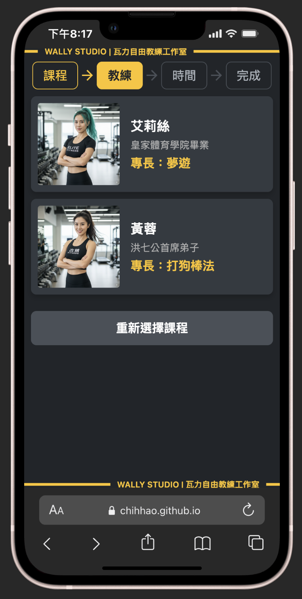
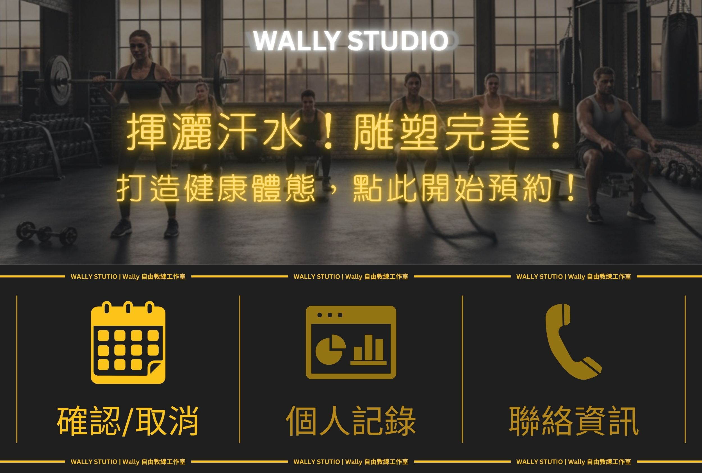

# WALLY-STUDIO

這是一套專為健身工作室設計的預約系統。

系統結合 LINE LIFF 應用程式，讓學員能方便地瀏覽課程、預約時段；同時也提供功能完整的網頁後台，供管理者處理預約、排課與學員管理。

後端採用 Supabase 處理資料庫、核心業務邏輯，以及 LINE Webhook 事件的接收。

---
 
## Logo 設計與品牌識別

| 扁平風格 | 金屬質感 (AI) | 霓虹燈 (AI) |
| :---: | :---: | :---: |
|  |  |  |

> **設計理念**：核心設計是巨大的「W」，結合頂部的啞鈴圖案，直接點出健身主題。外圍的圓形設計完美適配 Line 等社群平台的圓形頭像，確保在小尺寸下依然清晰可辨。整體扁平化風格與高對比的品牌色（暗色與橘黃色）結合，傳達出專業、簡潔有力且具高度辨識度的品牌形象。

---

## 專案亮點
本專案不僅是預約系統，更是一次完整的前後端與使用者體驗設計實踐。其中最具挑戰性的部分包含：
*   **視覺化課表管理**：為管理者打造一個直覺的拖曳式 (Drag-and-Drop) 排課介面，大幅簡化排課流程。
*   **無縫的 LINE 整合**：透過 LIFF 與 Webhook，讓學員從瀏覽、預約到查詢，所有操作都能在熟悉的 LINE 環境中完成，無需切換 App。
*   **原子化後端邏輯**：將複雜的預約與取消操作封裝在 Supabase 的資料庫函式 (RPC) 中，確保資料的一致性與安全性。

---

## 功能導覽

### 學員端：流暢無斷點的預約體驗

> **設計理念**：學員的所有操作應在熟悉的 LINE 環境中一氣呵成，從探索課程到完成預約，無需跳轉或安裝新 App，最大化便利性。

**1. 專案入口與品牌形象**

專案首頁 (`index.html`) 作為使用者進入 LIFF 應用的第一印象，透過簡潔專業的視覺設計，傳達工作室的品牌形象，並提供清晰的行動呼籲：「立即預約」。

| PC 版首頁 | 手機版首頁 |
| :---: | :---: |
|  |  |

**2. 無縫登入與課程瀏覽**

登入成功後，使用者會依序進入「課程選擇」(`courses.html`) 與「教練選擇」(`coaches.html`) 頁面。兩個頁面皆採用清晰的卡片式設計，透過一致的介面風格，引導使用者流暢地完成預約前的必要步驟。

| 選擇課程| 選擇教練 |
| :---: | :---: |
|  |  |

**3. 視覺化課表與預約**

> **設計巧思：** 為了在手機有限的螢幕空間內清晰呈現一週的時段，我設計了兩層式的互動介面：
> *   **週課表概覽:** 主畫面以「週」為單位，讓使用者能快速瀏覽整週的時段分佈，迅速找到有空的時間區塊。
> *   **點擊展開:** 當使用者點擊感興趣的「小時」格子時，該格子會動態展開，顯示內部更精細的「15分鐘」預約單位。
>
> 這種「概覽 + 細節」的設計，不僅避免一次性展示所有時段造成的畫面混亂，也讓預約流程更加直覺、流暢。

| 視覺化課表 | 展開每15分鐘的預約 |
| :---: | :---: |
|  |  |

**4. 數位化的預約證明**
> **設計理念：** 為提供完整且安心的預約體驗，使用者旅程的終點包含兩個關鍵畫面：
> *   **即時成功回饋 (`booking-complete.html`):** 預約操作完成後，系統會立即顯示一個充滿正向氛圍的成功頁面，並摘要顯示核心預約資訊，讓使用者獲得即時的安心感。
> *   **專業票券憑證 (`booking-details.html`):** 使用者可隨時查看設計精美的數位票券。此憑證不僅包含所有課程細節，更整合了用於現場核銷的 QR Code，為整個預約流程畫下專業、清晰的句點。

| 預約成功回饋 | 數位票券憑證 |
| :---: | :---: |
|  |  |

### 學員端：LINE 圖文選單

> **設計理念**：上方以健身圖景與橘黃色標語「揮灑汗水！雕塑完美！打造健康體態，點此開始預約！」激勵用戶並引導預約。下方三宮格以橘黃色圖標（日曆、圖表、電話）搭配簡潔文字，提供「確認/取消」、「個人記錄」和「聯絡資訊」功能，清晰易懂。整體以暗色背景襯托橘黃色主題，營造高度辨識度的健身品牌形象。

**確認預約 | 取消預約 | 聯絡資訊**

利用 LINE Flex Message 設計出豐富的互動卡片，讓使用者可以快速查詢、甚至觸發取消流程，將後端功能與前端體驗完美結合。

| 確認預約 | 取消預約 | 聯絡資訊 |
| :---: | :---: | :---: |
|  |  |  |

### 管理後台：強大直覺的營運中心

> **設計理念**：為管理者提供一個高效率、資訊視覺化的營運後台，將複雜的管理任務簡化為直覺的圖形化操作。

**1. 預約管理與儀表板**

透過 Google OAuth 確保後台安全性。主控台提供強大的篩選與搜尋功能，讓管理者能快速處理「已預約」的課程（扣款/取消）。

**2. ✨ 亮點功能：拖曳式課表管理 ✨**

利用 `interact.js` 打造高度互動的畫布課表。管理者可直接**拖曳**課程卡片來調整時間/日期，或**拉伸**卡片邊緣來改變課程長度，大幅提升排課效率。

**3. 資料管理：統一的 CRUD 介面**

所有核心資料（課程、教練、學員）皆有統一的管理介面，並透過 Modal 彈出視窗提供流暢的編輯體驗，無需刷新頁面。

---

## 技術棧

*   **後端**: Supabase (PostgreSQL)
*   **Webhook 服務**: Supabase Edge Functions (Deno)
*   **前端**: HTML, CSS, JavaScript, LINE LIFF SDK
*   **部署**: Supabase CLI, GitHub Pages

---
## 系統架構

### Supabase RPC 函式列表

> **設計實踐**：上圖展示了在 Supabase 中建立的部分核心 RPC 函式。前端應用程式（無論是學員端或管理後台）僅需呼叫這些預先定義好的函式，即可完成複雜的資料庫操作。這種架構不僅簡化了前端邏輯，更將所有權限控管與商業規則集中在後端，大幅提升了系統的安全性與可維護性。

---

## 專案設定與部署
詳細的本地端設定與部署流程，請參考 SetupAndDeployment.md。

---

## 未來規劃

本專案仍有許多可以擴充與優化的功能，以下是目前規劃中的主要項目：

*   **課堂記錄系統**
    *   **教練端**: 建立 LIFF 介面，讓教練能在課後記錄學員的出席狀況、訓練內容（動作、重量、次數）與給予評分。
    *   **學員端**: 建立 LIFF 介面，讓學員能查詢自己的歷史訓練記錄，追蹤進步歷程。
    *   **後台整合**: 在管理者後台新增課堂記錄的查詢與編輯功能。

*   **點數系統整合**
    *   實作完整的點數扣除機制，當管理者在後台將預約狀態改為「已扣款」時，自動扣除學員對應的點數。
    *   提供學員查詢點數餘額與消費記錄的功能。

*   **教練帳號綁定**
    *   開發一個 LINE Bot 輔助流程，讓管理者可以發送邀請，將系統中的教練資料與其個人的 LINE 帳號進行綁定。

*   **後台程式碼重構**
    *   將 `manager.html` 中龐大的 JavaScript 程式碼進行模組化，拆分成 `auth.js`, `navigation.js`, `data-loaders/*.js` 等多個檔案，以提高可維護性。
